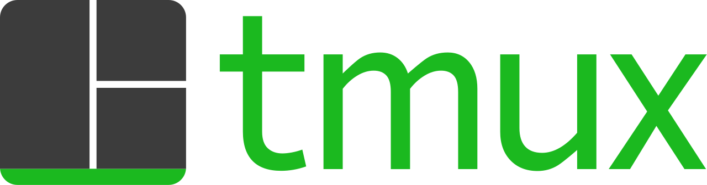
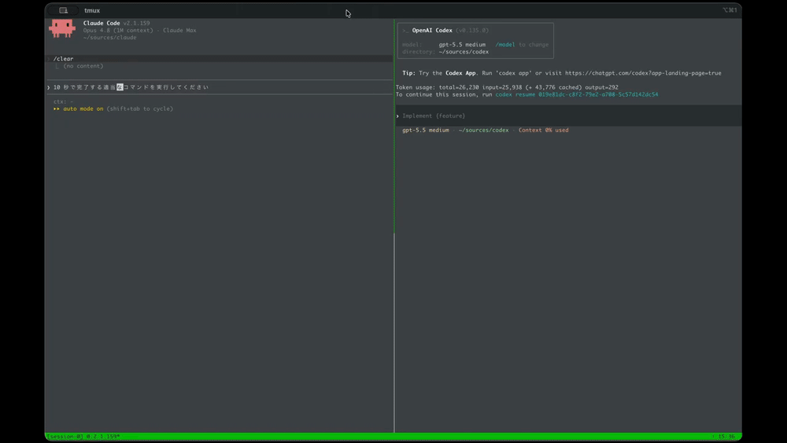
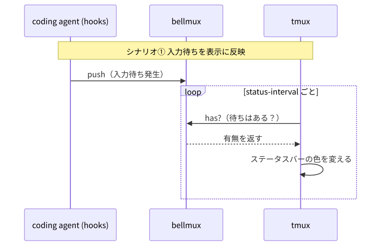
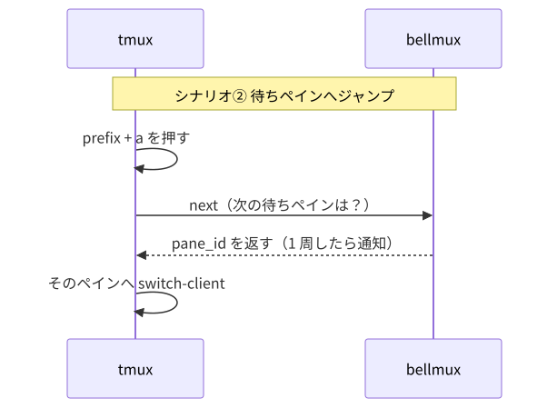

<!--
画像の出典（いずれも簡易発表用に引用。商標は各社に帰属）:
- tmux ロゴ: https://commons.wikimedia.org/wiki/File:Tmux_logo.svg
- Claude アイコン: https://commons.wikimedia.org/wiki/File:Claude_AI_symbol.svg
- OpenAI アイコン: https://commons.wikimedia.org/wiki/File:OpenAI_logo_2025_(symbol).svg
- デモ GIF: 自作（bellmux リポジトリ）
- 図（overview / scenario1 / scenario2）: diagrams/*.mmd から mermaid-cli で生成
-->

<style>
section {
  font-size: 26px;
}
/* 各スライドの見出し(h2)をタイトル(h1)と同じ色に揃える */
h2 { color: var(--h1-color); }
/* タイトル行の高さに収めるロゴ（本文の横幅を確保するため絶対配置） */
section.env { position: relative; }
.title-logo { position: absolute; top: 122px; right: 64px; height: 60px; }
.logos {
  display: flex;
  gap: 36px;
  align-items: center;
  justify-content: center;
  margin-top: 24px;
}
.logos img { height: 44px; }
.agent { display: flex; align-items: center; gap: 10px; font-weight: 700; }
.agent img { height: 30px; }
.lead-sub {
  color: #666;
  font-size: 22px;
}
section.title {
  display: flex;
  flex-direction: column;
  align-items: center;       /* 各ブロックを左右中央に */
  justify-content: center;   /* 全体を上下中央に */
}
section.title h1 {
  text-align: left;          /* タイトル文字は左揃え（ブロックは中央） */
  margin: 0;
}
.hero {
  display: flex;
  align-items: center;
  gap: 16px;
  margin-top: 40px;
}
.hero img { height: 38px; }
.hero img.tmux { height: 44px; }
.hero .item { display: flex; align-items: center; gap: 8px; font-weight: 700; font-size: 22px; }
.hero .conj { color: #9aa0a6; font-size: 20px; }
.hero .bell { font-weight: 700; font-size: 24px; }
.cols {
  display: flex;
  gap: 32px;
}
.cols > div { flex: 1; }
small { color: #777; }
.cite { display: flex; align-items: center; gap: 12px; margin-top: 40px; color: #777; }
.cite img { height: 30px; }
section.demo { text-align: center; }
section.demo h2 { margin-bottom: 8px; }
section.demo img { box-shadow: 0 4px 16px rgba(0,0,0,0.25); border-radius: 6px; }
</style>

<!-- _class: title -->

# Coding Agents の入力待ちを通知して、<br>その画面にジャンプしたい

<span class="lead-sub">— 環境とツール開発の紹介 —</span>

<!-- 「Claude Code / Codex on tmux with bellmux」をロゴ＋接続語で表現 -->
<div class="hero">
<span class="item"> Claude Code</span>
<span class="conj">&</span>
<span class="item"> Codex CLI</span>
<span class="conj">on</span>

<span class="conj">with</span>
<span class="bell">🔔 bellmux</span>
</div>

---

<!-- _class: env -->

## 開発環境の紹介 — tmux


**tmux = ターミナルマルチプレクサ**

- 1 つの画面を**複数のペイン / ウィンドウに分割**して使える
- **detach / attach**：作業状態を残したまま接続を切り、後でつなぎ直せる

**なぜ使っているか（きっかけはサーバー管理）**

- サーバー（数値計算・個人開発など）に ssh して作業 → 接続が切れても tmux 内の作業はそのまま残るのが便利だった
- そのうち**ローカル / サーバーで同じ操作感**が欲しくなり、ローカルでも同じ tmux 設定を使うように

---

## 最近の悩み：coding agents の「入力待ち」

<div class="logos" style="justify-content:flex-start; gap:48px">
<span class="agent"> Claude Code</span>
<span class="agent"> Codex CLI</span>
</div>

- coding agents は**自律的に動く時間がどんどん長く**なってきた
- すると tmux の**あちこちのペインで同時に走らせる**ようになる
- 結果、「**どこかで誰かが返事を待っている**」状態になりがち

待っているのは、たとえば…

- 🔐 **権限要求のダイアログ**が出ているペイン
- ✅ **ターンが終わって**次のプロンプトを待っているペイン
- ⏳ 長いビルドが終わったまま放置されているペイン

> どのペインが待っているのか、探し回るのが地味につらい

---

## 作ったもの：bellmux 🔔

**tmux と coding agents の「入力待ち」を取り次ぐ小さな CLI**

- 「このペインが待ち状態になった」を**記録**する
- 「待ちペインに移動したい」に**答える**
- それだけ。表示や音は tmux / agent 側の設定に任せる

<div class="cite">
<span>https://github.com/Daiius/bellmux</span>
</div>

---

<!-- 動作デモ。タイトルは表示せず画面いっぱいに。音やステータスバーの色変更は tmux / coding agent 側の設定によるもの -->


---

## 仕組み：既存の仕組みの“あいだ”を繋ぐだけ

<!-- diagrams/overview.mmd から生成 -->


- **agent → bellmux**：hooks が「待ちになった / 解除した」を `push` / `ack`
- **tmux → bellmux**：run-shell やキーバインドが「待ちはある？ / 次は？」を `has` / `next`
- bellmux は通知を**記録して返すだけ**。表示・音・ジャンプは tmux / agent 側に任せる

---

## できること（最小限の 4 機能）

| コマンド | 役割 |
|---|---|
| **push**（イベント通知） | 「このペインが待ち状態になった」を記録 |
| **ack**（イベント解除） | 「待ちが解除された」該当通知を削除 |
| **has**（有無返却） | 「待ちペインがあるか？」を返すだけの読み取り |
| **next**（pane を 1 つ返却） | 「次の待ちペインはこれ」を順番に返す |

- tmux には `run-shell`、coding agents には `hooks` という
  **「適切なタイミングでコマンドを実行する仕組み」がすでにある**
- なので bellmux 本体がやることはとても少ない

---

## 2 つのシナリオ

<div class="cols">
<div>

**① 入力待ちを表示に反映**

<!-- diagrams/scenario1.mmd から生成 -->


</div>
<div>

**② 待ちペインへジャンプ**

<!-- diagrams/scenario2.mmd から生成 -->


</div>
</div>

<small>※ <code>next</code> 自体は ack しません（「見に行っただけ」かもしれないので）。解除はプロンプト送信などの明示操作で。</small>

---

## 設定はちょっとだけ（init で雛形を出力）

<div class="cols">
<div>

**coding agent 側（hooks の例）**

```jsonc
// 権限要求やターン完了で push
"Notification": [{
  "matcher": "permission_prompt|elicitation_dialog",
  "hooks": [{ "type": "command",
    "command": "bellmux push --pane-id \"$TMUX_PANE\"" }]
}]
// プロンプト送信などで ack
```

</div>
<div>

**tmux 側（キーバインドの例）**

```sh
# 次の待ちペインへジャンプ
bind-key a run-shell '
  read -r pane tag <<<"$(bellmux next)"
  tmux switch-client -t "$pane"
'
```

</div>
</div>

- `bellmux init --preset claude-hooks` / `--preset keybinds` で雛形を出力
- **「どの通知を拾うか」は hook の matcher 任せ** → bellmux 本体は通知種別を知らないままで済む

---

## 特定のツールに依存しない

<div class="cols">
<div>

**coding agent 非依存**

- 受け取った通知を記録するだけ
- shell から呼べれば何でも連携可

</div>
<div>

**OS をあまり選ばない**

- Linux / macOS / Windows (WSL2 など)
- 原理的には幅広く動くはず

</div>
<div>

**tmux 以外も**

- Zellij / screen なども
- snippet を足すだけ、Rust 側は無変更

</div>
</div>

<br>

> 「特定の OS / coding agent に縛られない」のが bellmux の地味だけど効いている特徴

---

## まとめ

- tmux で**複数の coding agents を同時に走らせる**と、「どこかで誰かが入力待ち」になる
- **bellmux** はその入力待ちを *push / ack / has / next* で取り次ぐだけの小さな CLI
- 表示や音、「どれを拾うか」は既存の **hooks / run-shell** に寄せ、本体は最小限に

**同じ課題への他のアプローチ（参考）**

<small>

- cmux — https://cmux.com
- Claude Code Agent View — https://code.claude.com/docs/ja/agent-view
- agentoast — https://github.com/shuntaka9576/agentoast
- tmux-claude-queue — https://lib.rs/crates/tmux-claude-queue

</small>

---

## おまけ：名前の由来 🔔

- もともとは **「ユーザーの全 tty にベル文字を送って音を鳴らす」** `bellmux bell` という機能を考えていた（→ *bell* + *mux*）
- 今は OS の音声再生コマンドに置き換え（こちらの方が確実に鳴る）ので、事実上のボツ機能
- でも「音声再生はできないけど bell 文字でブザーは鳴らせる」環境向けに、コマンド自体は残っています

<br>

<small>github.com/Daiius/bellmux — おわり</small>
